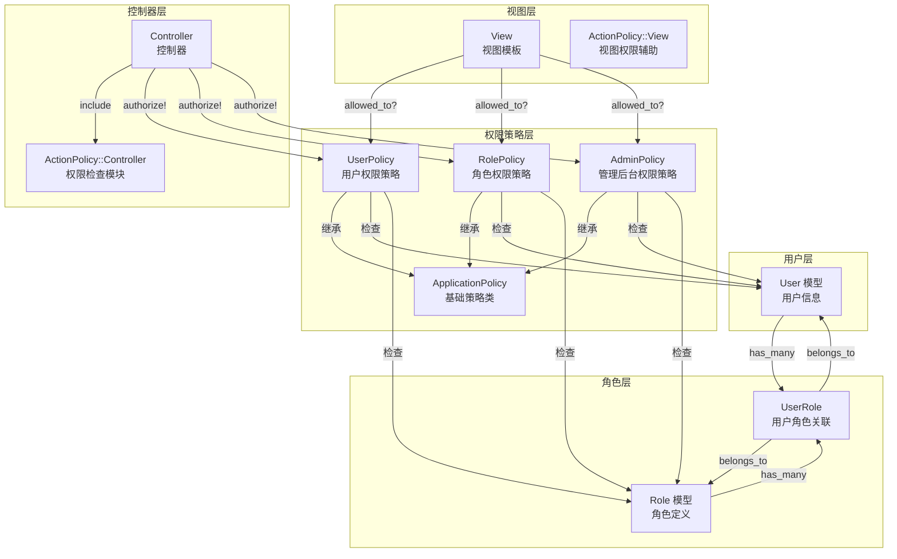
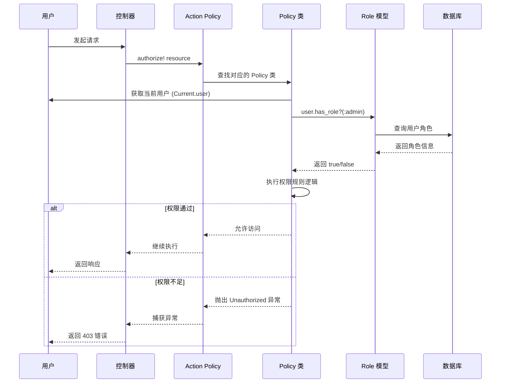
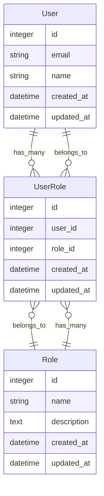
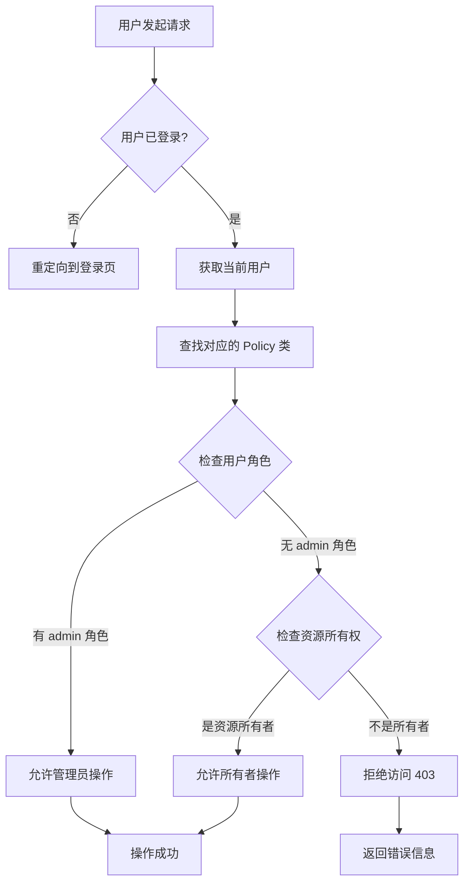

# 权限系统架构图

本文档通过架构图展示权限系统的整体设计和权限检查流程。

## 📊 系统架构概览



## 🔄 权限检查流程



## 🏗️ 数据模型关系



## 📁 代码组织结构

```
app/
├── models/
│   ├── user.rb              # User 模型（包含角色关联）
│   └── role.rb              # Role 模型
│
├── policies/
│   ├── application_policy.rb    # 基础 Policy 类
│   ├── user_policy.rb           # 用户权限策略
│   ├── role_policy.rb           # 角色权限策略
│   └── admin_policy.rb          # 管理后台权限策略
│
└── controllers/
    ├── application_controller.rb    # 包含 ActionPolicy::Controller
    ├── users_controller.rb           # 使用 authorize! 方法
    └── admin/
        ├── users_controller.rb       # 管理后台用户管理
        └── roles_controller.rb       # 管理后台角色管理

test/
├── policies/
│   ├── user_policy_test.rb      # Policy 类测试
│   └── role_policy_test.rb
└── models/
    ├── user_test.rb             # User 模型测试
    └── role_test.rb             # Role 模型测试
```

## 🔐 权限检查示例

### 1. 控制器中的权限检查

```ruby
class UsersController < ApplicationController
  include ActionPolicy::Controller

  def update
    @user = User.find(params[:id])
    authorize! @user  # 自动调用 UserPolicy#update?
    
    if @user.update(user_params)
      redirect_to @user
    else
      render :edit
    end
  end
end
```

### 2. Policy 类中的权限规则

```ruby
class UserPolicy < ApplicationPolicy
  def index?
    user.has_role?(:admin)
  end

  def show?
    user.has_role?(:admin) || user == record
  end

  def update?
    user.has_role?(:admin) || user == record
  end

  def destroy?
    user.has_role?(:admin)
  end
end
```

### 3. 视图中的权限检查

```erb
<% if allowed_to?(:update?, @user) %>
  <%= link_to "Edit", edit_user_path(@user) %>
<% end %>

<% if allowed_to?(:destroy?, @user) %>
  <%= button_to "Delete", @user, method: :delete %>
<% end %>
```

## 🎯 权限检查决策树



## 📋 角色与权限映射

| 角色 | 用户列表 | 查看用户 | 编辑用户 | 删除用户 | 管理角色 |
|------|---------|---------|---------|---------|---------|
| admin | ✅ | ✅ | ✅ | ✅ | ✅ |
| user | ❌ | ✅ (自己) | ✅ (自己) | ❌ | ❌ |

## 🔗 相关文档

- [开发计划](./plan.md) - 详细的开发任务清单
- [开发笔记](./notes.md) - 技术决策和问题记录
- [阶段概览](./README.md) - 阶段目标和功能列表
- [开发者指南](../DEVELOPER_GUIDE.md) - 权限系统详细说明

